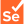

## Where you can find me

## What I do
I'm a software engineer, currently studying CS at the [Lucerne University of Applied Sciences](https://www.hslu.ch/en/lucerne-school-of-information-technology/).

## My current tech stack
### Backend

### Databases & Storage

### Frontend

## Personal projects and contributions

### [Algorithms & Data structures in Go](https://github.com/dominikstraessle/hslu-ad-golang)

Although all exercises from the Algorithms & Data structures course of the Lucerne University of Applied Sciences had to be implemented in Java, I completed most of them additionally in Go to gain more proficiency in the language.

### [summarizer](https://summarizer.straessle.me/)

Summarizer is a PWA that allows you so search and inspect saved items such as bookmarks, Github-Stars or saved Hacker-News articles.

- [summarizer-frontend](https://gitlab.com/summarizer/summarizer-frontend)  
- [summarizer-cli](https://gitlab.com/summarizer/summarizer-cli)

https://user-images.githubusercontent.com/23583759/157007035-4c135bbe-1be5-4321-a7c4-eeb864e0cda6.mp4

### [Beerpong-App](https://beerpong.bar)

Web-App to record all your beerpong-games and compare your stats with your friends.

https://user-images.githubusercontent.com/23583759/156721565-7beeb1ed-a0c4-4289-97ec-74661b477520.mp4

### [rentsy.ch](https://rentsy.ch/)

Web-App to manage rentable rooms and buildings in your city. Backend is based on a microservice architecture and written in Go.

The Frontend is built with Nuxt.js and Vuetify and the landing page is built with Tailwind.

### [homelab-dns](https://gitlab.com/dominikstraessle/homelab-dns)

Automatically update Cloudflare DNS records according to a dynamic domain name from an ISP.

### [MultiSweeper](https://github.com/Aaronmacaron/MultiSweeper)

MultiSweeper is a multiplayer implementation of the popular game MineSweeper.

https://user-images.githubusercontent.com/23583759/157011729-983c1111-b74f-439d-bde8-373e23cd8593.mp4

### [formail](https://gitlab.com/aakado/formail)

API-Backend to validate and forward form data from client-side only websites via email.

### [Pregnancy Calculator for Doctors](https://play.google.com/store/apps/details?id=ch.gibmit.straessle.dominik.schwangerschaftsrechner&hl=en&gl=US)

Calculate all important dates for a pregnancy with one single app.

## Other Technologies
### Tech Tools & Dev-Environment

### Tools & Services

### Tech used before

